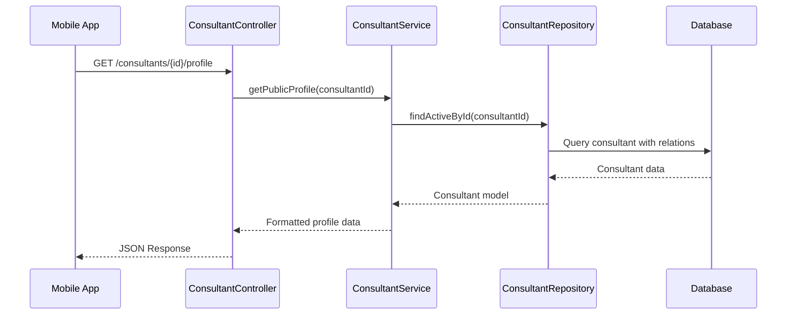

# Design Document: Consultant Public Profile API

## Overview

هذا التصميم يحدد API لعرض الملف الشخصي العام للمستشار، والذي يتضمن الشهادات والخبرات والخدمات. سيتم إضافة endpoint جديد في `Mobile/ConsultantController` الموجود حالياً.

## Architecture

### Endpoint Design

```
GET /api/mobile/consultants/{consultantId}/profile
```

### Request Flow



## Components and Interfaces

### 1. Controller Layer

**File:** `app/Http/Controllers/Api/Mobile/ConsultantController.php`

```php
/**
 * جلب الملف الشخصي العام للمستشار
 * GET /api/mobile/consultants/{consultantId}/profile
 */
public function profile(int $consultantId, ConsultantService $consultantService)
{
    // 1. جلب المستشار النشط
    // 2. جلب الشهادات والخبرات والخدمات
    // 3. تنسيق البيانات وإرجاعها
}
```

### 2. Service Layer

**File:** `app/Services/ConsultantService.php`

```php
/**
 * جلب الملف الشخصي العام للمستشار
 */
public function getPublicProfile(int $consultantId): array
{
    // 1. التحقق من وجود المستشار ونشاطه
    // 2. جلب العلاقات (certificates, experiences, service)
    // 3. تنسيق البيانات حسب المتطلبات
}
```

### 3. DTO Layer

**File:** `app/DTOs/ConsultantPublicProfileDTO.php` (جديد)

```php
class ConsultantPublicProfileDTO extends BaseDTO
{
    public static function fromModel(Consultant $consultant): self
    {
        // تحويل البيانات للتنسيق المطلوب
    }
}
```

## Data Models

### Response Structure

```json
{
    "success": true,
    "message": "تم جلب الملف الشخصي بنجاح",
    "data": {
        "consultant_id": 1,
        "certificates": [
            {
                "id": 1,
                "status": "approved",
                "is_verified": true,
                "verified_at": "2026-01-10T10:00:00Z"
            }
        ],
        "experiences": [
            {
                "name": "خبرة في التسويق الرقمي"
            }
        ],
        "services": [
            {
                "id": 1,
                "title": "استشارة تسويقية",
                "description": "استشارة شاملة في التسويق الرقمي",
                "price": "150.00",
                "category": {
                    "id": 1,
                    "name": "التسويق"
                }
            }
        ]
    }
}
```

### Database Relations Used

```
Consultant
├── certificates() -> hasMany(Certificate)
├── experiences() -> hasMany(ConsultantExperience)
└── service() -> hasOne(ConsultantService)
    └── category() -> belongsTo(Category)
```

## Correctness Properties

*A property is a characteristic or behavior that should hold true across all valid executions of a system-essentially, a formal statement about what the system should do. Properties serve as the bridge between human-readable specifications and machine-verifiable correctness guarantees.*

### Property 1: Response Structure Validation

*For any* valid consultant ID with associated data, the API response SHALL contain:
- `experiences` array where each item contains only the `name` field
- `services` array where each item contains `title`, `description`, `price`, and `category` (as nested object with `id` and `name`)
- `certificates` array with certificate data

**Validates: Requirements 1.2, 1.3, 1.4, 2.2, 2.3**

### Property 2: Empty Data Handling

*For any* valid consultant ID, if the consultant has no certificates, experiences, or services, the API SHALL return empty arrays `[]` for those fields, not null or missing keys.

**Validates: Requirements 2.4**

### Property 3: Non-Existent Consultant Error

*For any* consultant ID that does not exist in the database, the API SHALL return a 404 HTTP status code with an appropriate error message.

**Validates: Requirements 1.5**

### Property 4: Inactive Consultant Error

*For any* consultant ID where `is_active = false`, the API SHALL return a 404 HTTP status code with an appropriate error message.

**Validates: Requirements 1.6**

## Error Handling

| Scenario | HTTP Status | Response Message |
|----------|-------------|------------------|
| Consultant not found | 404 | المستشار غير موجود |
| Consultant not active | 404 | المستشار غير متاح حالياً |
| Server error | 500 | حدث خطأ في الخادم |

## Testing Strategy

### Unit Tests

1. **Service Layer Tests:**
   - Test `getPublicProfile` returns correct data structure
   - Test handling of consultant with no certificates/experiences/services
   - Test exception thrown for non-existent consultant
   - Test exception thrown for inactive consultant

2. **DTO Tests:**
   - Test `ConsultantPublicProfileDTO::fromModel` produces correct output

### Property-Based Tests

سيتم استخدام **PHPUnit** مع **Faker** لتوليد بيانات عشوائية للاختبارات.

**Configuration:**
- Minimum 100 iterations per property test
- Each test tagged with property reference

```php
/**
 * @test
 * Feature: consultant-public-profile-api, Property 1: Response Structure Validation
 * Validates: Requirements 1.2, 1.3, 1.4, 2.2, 2.3
 */
public function response_structure_is_valid_for_any_consultant()
{
    // Generate random consultant with data
    // Call API
    // Assert structure matches requirements
}
```

### Integration Tests

1. Test full request/response cycle
2. Test with real database data
3. Test authentication not required (public endpoint)

## Future Considerations

الـ API مصمم لدعم إضافة التقييمات مستقبلاً:

```json
{
    "data": {
        "consultant_id": 1,
        "rating_avg": 4.5,      // مستقبلي
        "ratings_count": 120,   // مستقبلي
        "certificates": [...],
        "experiences": [...],
        "services": [...]
    }
}
```

هذه الحقول موجودة بالفعل في model الـ `Consultant` (`rating_avg`, `ratings_count`) ويمكن إضافتها للـ response بسهولة.
