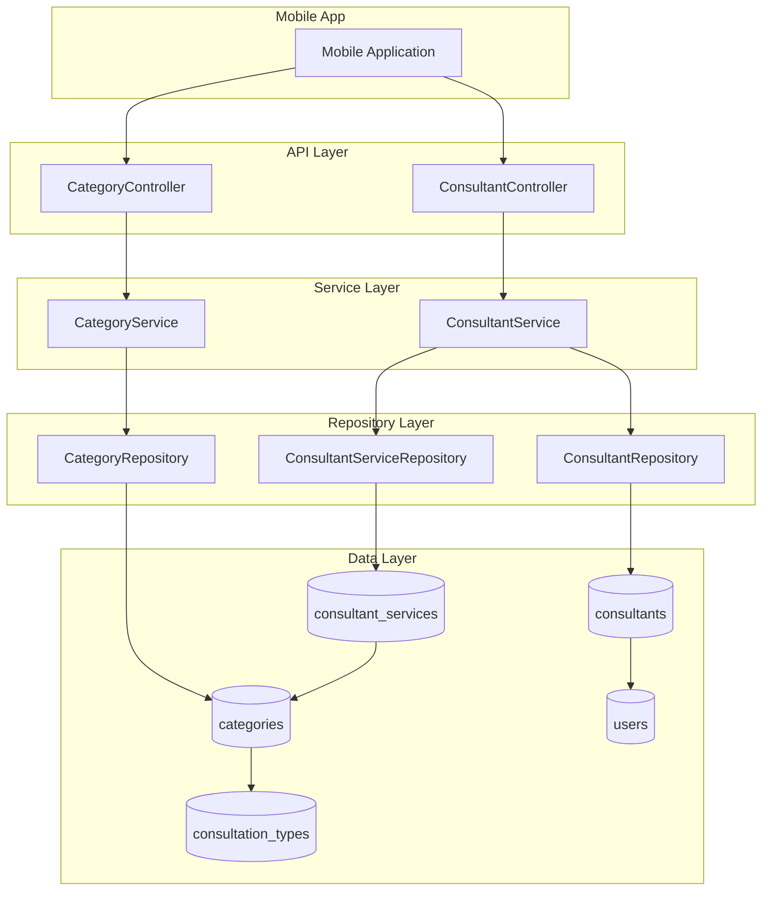
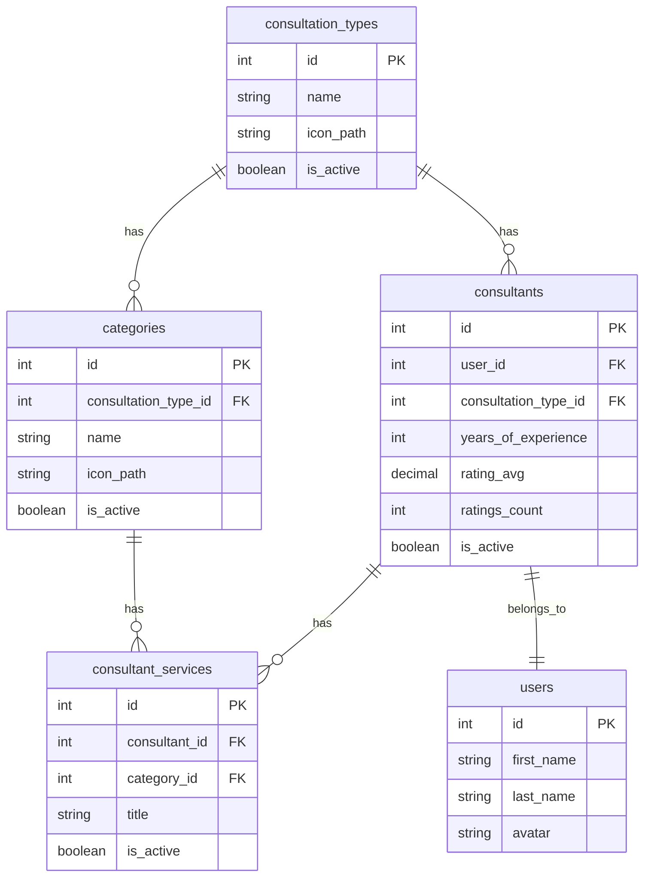

# Design Document: Mobile App APIs

## Overview

هذا التصميم يحدد بنية APIs لتطبيق الجوال التي تتيح استعراض الفئات والمستشارين. يتبع التصميم النمط الموجود في المشروع باستخدام Controllers, Services, Repositories, و DTOs.

## Architecture



## Components and Interfaces

### API Endpoints

| Endpoint | Method | Controller | Description |
|----------|--------|------------|-------------|
| `/api/mobile/categories` | GET | CategoryController | جلب جميع الفئات النشطة |
| `/api/mobile/categories/by-consultation-type/{id}` | GET | CategoryController | جلب الفئات حسب نوع الاستشارة مع عدد المستشارين |
| `/api/mobile/consultants/by-category/{id}` | GET | ConsultantController | جلب المستشارين حسب الفئة |
| `/api/mobile/consultants` | GET | ConsultantController | عرض المستشارين مع خيارات الترتيب |

### Controllers

#### CategoryController (Api/Mobile)

```php
class CategoryController extends Controller
{
    use SuccessResponse;
    
    // GET /api/mobile/categories
    public function index(CategoryService $categoryService): JsonResponse
    
    // GET /api/mobile/categories/by-consultation-type/{consultationTypeId}
    public function byConsultationType(
        int $consultationTypeId, 
        CategoryService $categoryService
    ): JsonResponse
}
```

#### ConsultantController (Api/Mobile)

```php
class ConsultantController extends Controller
{
    use SuccessResponse, CanFilter;
    
    // GET /api/mobile/consultants/by-category/{categoryId}
    public function byCategory(
        int $categoryId, 
        Request $request,
        ConsultantService $consultantService
    ): JsonResponse
    
    // GET /api/mobile/consultants
    // Query params: sort_by (experience|rating|reviews), per_page
    public function index(
        Request $request, 
        ConsultantService $consultantService
    ): JsonResponse
}
```

### Services

#### CategoryService (Extended Methods)

```php
// جلب الفئات النشطة للجوال
public function getActiveForMobile(): Collection

// جلب الفئات حسب نوع الاستشارة مع عدد المستشارين
public function getByConsultationTypeWithConsultantsCount(int $consultationTypeId): Collection
```

#### ConsultantService (Extended Methods)

```php
// جلب المستشارين حسب الفئة
public function getByCategory(int $categoryId, int $perPage = 10): LengthAwarePaginator

// جلب المستشارين مع الترتيب
public function getForMobile(
    ?string $sortBy = null, 
    int $perPage = 10
): LengthAwarePaginator

// جلب فئات خدمات المستشار (بدون تكرار)
public function getServiceCategories(Consultant $consultant): array
```

### DTOs

#### CategoryMobileDTO

```php
class CategoryMobileDTO
{
    public int $id;
    public string $name;
    public ?string $icon_url;
    public ?int $consultants_count;
    
    public static function fromModel(Category $category): self
    public function toArray(): array
    public function toArrayWithCount(): array
}
```

#### ConsultantMobileDTO

```php
class ConsultantMobileDTO
{
    public int $id;
    public string $first_name;
    public string $last_name;
    public ?string $avatar;
    public float $rating_avg;
    public int $ratings_count;
    public array $service_categories;
    
    public static function fromModel(Consultant $consultant, array $serviceCategories): self
    public function toArray(): array
}
```

## Data Models

### Entity Relationships



### Query Patterns

#### جلب الفئات مع عدد المستشارين

```sql
SELECT categories.*, 
       COUNT(DISTINCT consultants.id) as consultants_count
FROM categories
LEFT JOIN consultant_services ON categories.id = consultant_services.category_id
LEFT JOIN consultants ON consultant_services.consultant_id = consultants.id 
                      AND consultants.is_active = true
WHERE categories.consultation_type_id = ?
  AND categories.is_active = true
GROUP BY categories.id
```

#### جلب المستشارين حسب الفئة

```sql
SELECT DISTINCT consultants.*
FROM consultants
INNER JOIN consultant_services ON consultants.id = consultant_services.consultant_id
WHERE consultant_services.category_id = ?
  AND consultants.is_active = true
```

## Correctness Properties

*A property is a characteristic or behavior that should hold true across all valid executions of a system-essentially, a formal statement about what the system should do. Properties serve as the bridge between human-readable specifications and machine-verifiable correctness guarantees.*

### Property 1: Active Categories Filter

*For any* request to the categories endpoint, all returned categories SHALL have is_active equal to true, and no inactive categories SHALL be included in the response.

**Validates: Requirements 1.1, 1.3, 2.5**

### Property 2: Category Response Structure

*For any* category returned from the mobile categories endpoint, the response SHALL contain exactly the fields: id, name, icon_url (and consultants_count when applicable), with no additional fields exposed.

**Validates: Requirements 1.2, 2.2**

### Property 3: Consultants Count Calculation

*For any* category returned with consultants_count, the count SHALL equal the number of distinct active consultants (is_active = true) who have at least one service in that category.

**Validates: Requirements 2.3, 2.4**

### Property 4: Category Filtering by Consultation Type

*For any* request with a valid consultation_type_id, all returned categories SHALL have consultation_type_id equal to the provided value.

**Validates: Requirements 2.1**

### Property 5: Consultant Response Structure

*For any* consultant returned from the mobile consultants endpoints, the response SHALL contain exactly the fields: id, first_name, last_name, avatar, rating_avg, ratings_count, service_categories.

**Validates: Requirements 3.2, 4.2**

### Property 6: Unique Service Categories

*For any* consultant returned, the service_categories array SHALL contain unique category names with no duplicates, representing all categories from the consultant's services.

**Validates: Requirements 3.3, 4.3**

### Property 7: Active Consultants Filter

*For any* request to the consultants endpoints, all returned consultants SHALL have is_active equal to true, and no inactive consultants SHALL be included in the response.

**Validates: Requirements 3.4, 4.1, 4.9**

### Property 8: Consultant Sorting

*For any* request with sort_by parameter:
- When sort_by = "experience": consultants SHALL be ordered by years_of_experience descending
- When sort_by = "rating": consultants SHALL be ordered by rating_avg descending  
- When sort_by = "reviews": consultants SHALL be ordered by ratings_count descending
- When sort_by is not provided: consultants SHALL be ordered by created_at descending

**Validates: Requirements 4.4, 4.5, 4.6, 4.7**

### Property 9: Pagination Consistency

*For any* paginated request with per_page parameter, the number of items returned SHALL not exceed the per_page value, and pagination metadata SHALL accurately reflect total items and pages.

**Validates: Requirements 3.7, 4.8**

### Property 10: Consultants by Category Relationship

*For any* request with a valid category_id, all returned consultants SHALL have at least one service with category_id equal to the provided value.

**Validates: Requirements 3.1**

## Error Handling

| Scenario | HTTP Status | Response |
|----------|-------------|----------|
| نوع استشارة غير موجود | 404 | `{"success": false, "message": "نوع الاستشارة غير موجود"}` |
| فئة غير موجودة | 404 | `{"success": false, "message": "الفئة غير موجودة"}` |
| قيمة sort_by غير صالحة | 422 | `{"success": false, "message": "قيمة الترتيب غير صالحة"}` |
| خطأ في الخادم | 500 | `{"success": false, "message": "حدث خطأ في الخادم"}` |

## Testing Strategy

### Unit Tests

- اختبار DTOs للتحقق من صحة التحويل من Model إلى Array
- اختبار Services للتحقق من منطق الأعمال
- اختبار error handling للحالات الاستثنائية

### Property-Based Tests

سيتم استخدام مكتبة **PHPUnit** مع **Faker** لتوليد بيانات عشوائية للاختبارات.

كل property test يجب أن يعمل على الأقل 100 تكرار للتحقق من صحة الخصائص.

**تنسيق التعليقات:**
```php
/**
 * Feature: mobile-app-apis, Property N: [Property Title]
 * Validates: Requirements X.Y
 */
```

### Integration Tests

- اختبار API endpoints مع قاعدة بيانات اختبارية
- التحقق من صحة الاستجابات وهيكلها
- اختبار pagination و sorting
