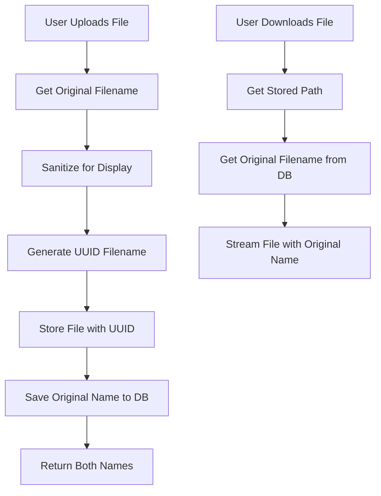
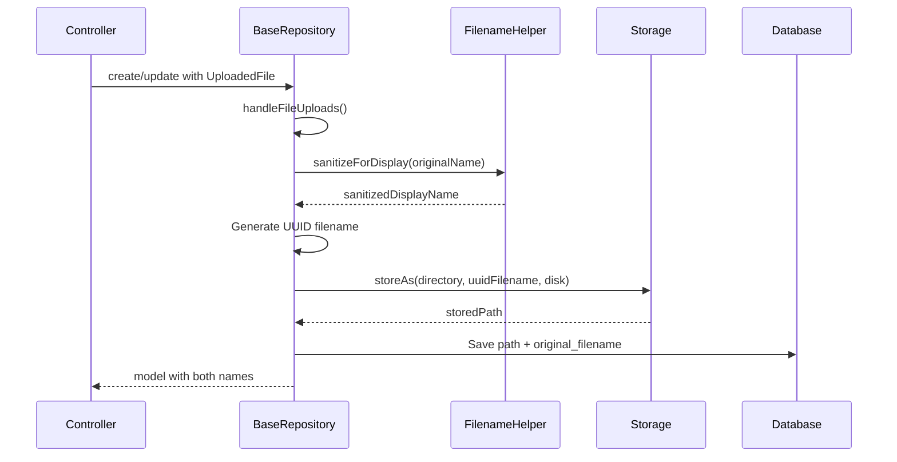

# Design Document: Preserve Original Filename (Dual Storage Approach)

## Overview

هذا التصميم يصف نهج فصل اسم الملف المخزن عن اسم الملف المعروض. سيتم:
- **تخزين الملف**: باستخدام UUID (كما هو حالياً) للأمان وتجنب التعارضات
- **حفظ الاسم الأصلي**: في عمود جديد بقاعدة البيانات للعرض والتحميل

### Benefits of This Approach

| Aspect | UUID Storage | Original Name Display |
|--------|-------------|----------------------|
| Security | ✅ No path traversal attacks | ✅ Sanitized for display |
| Uniqueness | ✅ Guaranteed unique | N/A |
| User Experience | N/A | ✅ Familiar filenames |
| Scalability | ✅ No collision handling needed | ✅ Easy to extend |

## Architecture

### High-Level Flow



### Component Interaction



## Components and Interfaces

### 1. FilenameHelper Class (New)

ملف مساعد للتعامل مع أسماء الملفات.

**Location:** `app/Support/FilenameHelper.php`

```php
<?php

namespace App\Support;

class FilenameHelper
{
    /**
     * Maximum allowed display filename length
     */
    public const MAX_DISPLAY_LENGTH = 255;

    /**
     * Sanitize filename for safe display (removes HTML, scripts, etc.)
     * Preserves Arabic and English characters.
     */
    public static function sanitizeForDisplay(string $filename): string
    {
        // Remove null bytes
        $filename = str_replace("\0", '', $filename);
        
        // Strip HTML tags
        $filename = strip_tags($filename);
        
        // Remove path traversal attempts
        $filename = basename($filename);
        
        // Trim whitespace
        $filename = trim($filename);
        
        // Normalize multiple spaces
        $filename = preg_replace('/\s+/', ' ', $filename);
        
        // Truncate if too long (preserve extension)
        if (mb_strlen($filename) > self::MAX_DISPLAY_LENGTH) {
            $extension = pathinfo($filename, PATHINFO_EXTENSION);
            $name = pathinfo($filename, PATHINFO_FILENAME);
            $maxNameLength = self::MAX_DISPLAY_LENGTH - mb_strlen($extension) - 1;
            $filename = mb_substr($name, 0, $maxNameLength) . '.' . $extension;
        }
        
        return $filename;
    }

    /**
     * Get a fallback filename when original is empty
     */
    public static function getFallbackName(string $extension): string
    {
        return 'file_' . date('Y-m-d_His') . '.' . $extension;
    }

    /**
     * Handle edge case of extension-only filename
     */
    public static function ensureValidName(string $filename): string
    {
        $name = pathinfo($filename, PATHINFO_FILENAME);
        $extension = pathinfo($filename, PATHINFO_EXTENSION);
        
        if (empty($name) || trim($name) === '') {
            return 'file.' . ($extension ?: 'bin');
        }
        
        if (empty($extension)) {
            return $filename;
        }
        
        return $filename;
    }
}
```

### 2. Modified BaseRepository

تعديل `handleFileUploads()` لإرجاع كلا الاسمين:

```php
protected function handleFileUploads(array $attributes, ?Model $record = null): array
{
    foreach ($attributes as $key => &$value) {
        if ($value instanceof UploadedFile) {
            $strategy = $this->getFileStorageForAttribute($key);
            $oldPath = $record && $record->{$key} ? $record->{$key} : null;

            // Capture original filename
            $originalName = $value->getClientOriginalName();
            $extension = $value->getClientOriginalExtension();
            
            // Sanitize for display
            $displayName = FilenameHelper::sanitizeForDisplay($originalName);
            $displayName = FilenameHelper::ensureValidName($displayName);
            
            // Generate UUID for storage (existing behavior)
            $uuidFilename = (string) Str::uuid() . '.' . $extension;
            
            $directory = $this->model->getTable();
            $disk = $strategy === 'private' ? 'local' : 'public';

            // Clean up old file...
            // Store with UUID filename...
            
            $path = $value->storeAs($directory, $uuidFilename, $disk);
            $value = $path;
            
            // Store original filename if model supports it
            $originalNameColumn = $key . '_original_name';
            if ($this->modelHasColumn($originalNameColumn)) {
                $attributes[$originalNameColumn] = $displayName;
            }
        }
    }
    return $attributes;
}

/**
 * Check if model's table has a specific column
 */
protected function modelHasColumn(string $column): bool
{
    return \Schema::hasColumn($this->model->getTable(), $column);
}
```

### 3. Database Migration

إضافة عمود للاسم الأصلي في الجداول المطلوبة:

```php
// Migration for certificates table
Schema::table('certificates', function (Blueprint $table) {
    $table->string('document_scan_copy_original_name', 255)->nullable()->after('document_scan_copy');
});
```

### 4. Modified DTO

تحديث DTO لتضمين الاسم الأصلي:

```php
// In CertificateDTO
public static function fromModel(Certificate $certificate): self
{
    return new self([
        // ... existing fields
        'document_scan_copy' => $certificate->document_scan_copy,
        'document_scan_copy_original_name' => $certificate->document_scan_copy_original_name,
        // ...
    ]);
}
```

### 5. Modified Download Method

تحديث طريقة التحميل لاستخدام الاسم الأصلي:

```php
public function streamDocument(Certificate $certificate, bool $download = false): StreamedResponse
{
    // ... existing validation ...
    
    // Use original filename for download, fallback to stored filename
    $downloadName = $certificate->document_scan_copy_original_name 
        ?? basename($certificate->document_scan_copy);
    
    return response()->stream(function () use ($stream) {
        fpassthru($stream);
        if (is_resource($stream)) {
            fclose($stream);
        }
    }, 200, [
        'Content-Type' => $mimeType,
        'Content-Disposition' => sprintf(
            '%s; filename="%s"; filename*=UTF-8\'\'%s',
            $download ? 'attachment' : 'inline',
            $downloadName,
            rawurlencode($downloadName)
        ),
    ]);
}
```

## Data Models

### Certificate Model Update

```php
class Certificate extends BaseModel
{
    protected $fillable = [
        // ... existing fields
        'document_scan_copy',
        'document_scan_copy_original_name', // NEW
        // ...
    ];
}
```

### Naming Convention

لكل حقل ملف `{field_name}`:
- `{field_name}` - مسار الملف المخزن (UUID-based)
- `{field_name}_original_name` - الاسم الأصلي للعرض

## Correctness Properties

*A property is a characteristic or behavior that should hold true across all valid executions of a system-essentially, a formal statement about what the system should do.*

### Property 1: Original Name Preservation

*For any* uploaded file with a valid original filename containing Arabic or English characters, the stored `original_name` metadata SHALL contain the same characters (after safe sanitization for display).

**Validates: Requirements 2.1, 2.2, 2.3**

### Property 2: Sanitization Safety

*For any* original filename, after sanitization for display, the result SHALL NOT contain HTML tags, script elements, or null bytes, ensuring safe rendering in the UI.

**Validates: Requirements 3.1, 3.2**

### Property 3: UUID Storage Uniqueness

*For any* sequence of file uploads, each stored filename (UUID-based) SHALL be unique, regardless of the original filenames being identical.

**Validates: Requirements 1.1, 1.2**

### Property 4: Download Name Consistency

*For any* file download request, the download filename SHALL match the stored original_name (or fallback to stored filename if original_name is null).

**Validates: Requirements 2.4**

### Property 5: Sanitization Idempotence

*For any* filename, sanitizing an already-sanitized filename SHALL produce the same result (sanitize(sanitize(x)) == sanitize(x)).

**Validates: Requirements 3.1, 3.2, 3.3**

## Error Handling

| Scenario | Handling |
|----------|----------|
| Empty original filename | Use fallback "file_TIMESTAMP.ext" |
| Filename too long (>255 chars) | Truncate while preserving extension |
| Extension-only filename | Prepend "file" |
| Null bytes in filename | Remove them |
| HTML/script in filename | Strip tags |
| Model without original_name column | Gracefully skip storing original name |

## Testing Strategy

### Unit Tests

1. **FilenameHelper::sanitizeForDisplay() Tests**
   - Arabic character preservation
   - English character preservation
   - HTML tag removal
   - Null byte removal
   - Long filename truncation
   - Space normalization

2. **FilenameHelper::ensureValidName() Tests**
   - Empty filename handling
   - Extension-only filename handling
   - Normal filename passthrough

3. **BaseRepository Integration Tests**
   - File upload with original name stored
   - File upload without original_name column (graceful degradation)
   - Download with original name

### Property-Based Tests

سيتم استخدام **PHPUnit** مع **eris/eris** للـ Property-Based Testing.

**Configuration:**
- Minimum 100 iterations per property test
- Tag format: **Feature: preserve-original-filename, Property N: [property_text]**

**Test Files:**
- `tests/Unit/Support/FilenameHelperTest.php` - Unit tests
- `tests/Unit/Support/FilenameHelperPropertyTest.php` - Property-based tests
